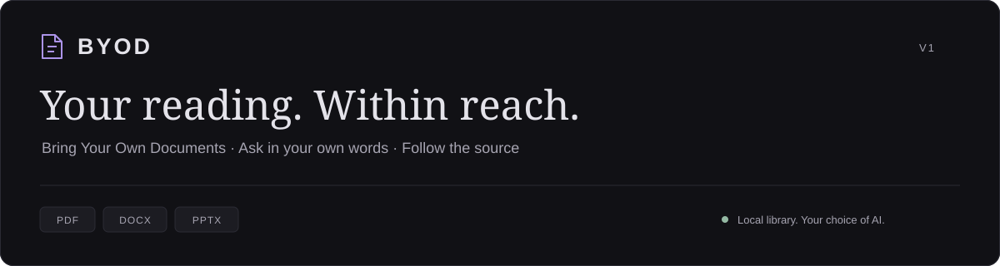
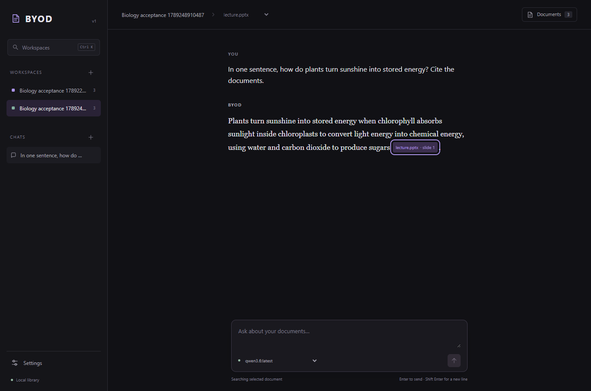
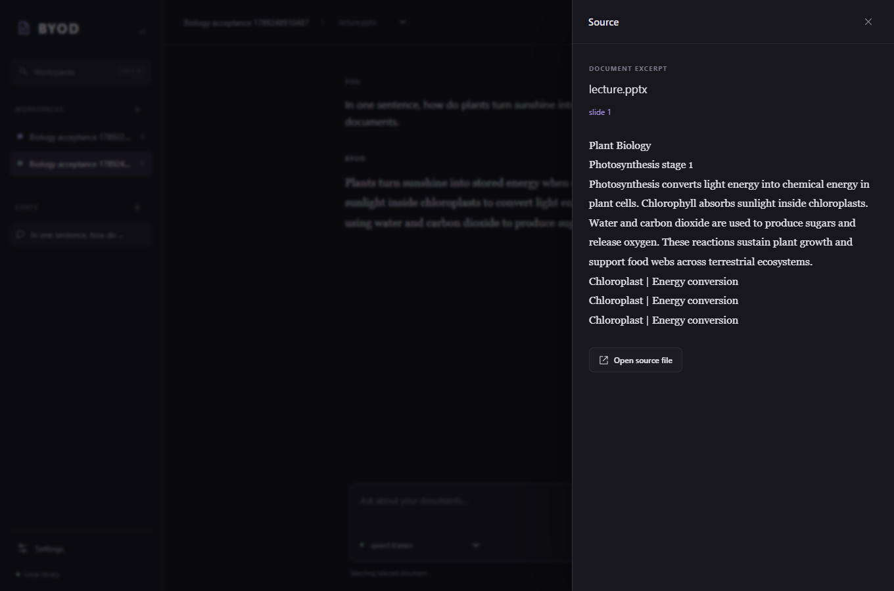

<p align="center">
  
</p>

<p align="center">
  A quiet place for your course documents, questions, and source-backed answers.
  <br />
  <strong>Add your readings once. Come back to them whenever you need.</strong>
</p>

<p align="center">
  <a href="#setup-instructions">Setup instructions</a> ·
  <a href="#using-byod">Using BYOD</a> ·
  <a href="#your-data">Your data</a> ·
  <a href="#troubleshooting">Troubleshooting</a>
</p>

---

## A reading space that stays yours

BYOD turns your PDFs, Word documents, and slide decks into a searchable course
library. Ask a question in your own words, read an answer grounded in your
materials, and follow its citations back to the exact page, heading, or slide.

| Bring your material | Find the context | Keep your place |
| :--- | :--- | :--- |
| Add PDF, DOCX, and PPTX files or a whole folder. | Search across a course or focus on one document. | Return to saved chats and open the sources behind an answer. |

Your library and embeddings stay on your machine. Choose OpenAI, Anthropic, or
local Ollama for answers. With a cloud provider, your question, recent conversation,
and retrieved excerpts are sent to that provider for the reply. API keys stay in
your OS keychain. BYOD has no accounts, analytics, or hosted backend.

<details>
<summary><strong>Take a look inside</strong></summary>





*Screenshots use the project's synthetic test documents.*

</details>

---

## Setup instructions

BYOD v1 runs from this project folder. Setup has two parts: build the app, then
choose the provider you want to use for answers. Windows is the verified development
platform; the commands below also work in a macOS or Linux terminal unless marked.

### 1. Install the essentials

| Tool | Version | Get it |
| :--- | :--- | :--- |
| Python | 3.11 or newer | [Python downloads](https://www.python.org/downloads/) |
| uv | Python dependency manager | [uv installation guide](https://docs.astral.sh/uv/getting-started/installation/) |
| Node.js and npm | Node 20.19+ or 22.12+; npm comes with Node | [Node.js downloads](https://nodejs.org/en/download) |

On Windows, enable **Add Python to PATH** if the installer offers it. After
installing the tools, reopen your terminal so it can find them.

You also need either a provider API key or a local Ollama installation with a
model. You can configure that in step 4. Initial dependency installation and the
first embedding-model download require internet access.

### 2. Open the project and install dependencies

Download or clone this project, then open a terminal in the **BYOD** folder—the
folder containing `pyproject.toml` and this README. If you already have the project
open, use its terminal.

Run these commands one at a time:

```sh
uv sync --locked
npm ci --prefix byod/ui
npm run build --prefix byod/ui
```

`uv sync` creates the Python environment. The npm commands install and compile the
interface. You only need to rebuild when the frontend changes.

> **Windows PowerShell:** if PowerShell blocks `npm.ps1`, use `npm.cmd` in place
> of `npm` in the commands above. No execution-policy change is needed.

### 3. Start BYOD

From the same project folder:

```sh
uv run byod serve
```

BYOD creates its data directory automatically and opens your browser. Keep the
terminal running while you use the app; **Ctrl+C** stops it. If the browser does
not open, copy the local address printed in the terminal.

For a predictable address, run:

```sh
uv run byod serve --port 8765 --no-open
```

Then open **[http://127.0.0.1:8765](http://127.0.0.1:8765)**. BYOD serves the
interface and API from this one local process.

### 4. Choose your provider

Create a workspace with the **+** beside **Workspaces**, name it for a course,
then open **Settings** to choose how BYOD answers questions in that workspace.

**OpenAI or Anthropic**

1. Select the provider in Settings.
2. Enter your provider API key and click **Validate & save key**.
3. Choose a model and click **Save settings**.

BYOD validates the key before storing it in the OS keychain. Enter keys only in
Settings; no `.env` file or manual key configuration is required.

**Ollama — local answers**

1. Follow the [official Ollama quickstart](https://docs.ollama.com/quickstart) to
   install Ollama and download a model that fits your machine.
2. Keep Ollama running at `localhost:11434`. Run `ollama list` in a terminal to
   confirm you have a model installed.
3. Open BYOD's Settings, select **Ollama**, choose the model, and **Save settings**.

Ollama needs no API key. Model size and available RAM affect response speed;
large models running on CPU can take several minutes to load. BYOD does not
install a reasoning model for you.

### 5. Add documents and ask your first question

1. Open **Documents → Add files** and paste full file paths, one per line.
   On Windows, File Explorer's **Copy as path** is useful here. For a course folder,
   choose **Add folder** and paste its full path instead.
2. Click **Add documents** and wait for the files to show **Indexed**. The first
   ingestion downloads the local embedding model, about **138 MB**; progress
   appears in the document panel.
3. Close the panel, type a question about the material, and press **Enter**.
4. Click a citation to read its source excerpt. **Open source file** opens the
   original document.

Your setup is complete. On your next visit, run `uv run byod serve` again from
the project folder. Your workspaces and chats will still be there.

---

## Using BYOD

Keep a workspace for each course. The document menu at the top lets you switch
between **All documents** and a specific file. Re-adding a folder skips already
indexed content; use **Re-index** after editing a source file.

Ask specific questions in natural language. For follow-ups, include the subject
again so retrieval has enough context. If nothing matches, BYOD says so.

| Shortcut | Action |
| :--- | :--- |
| Ctrl+K / ⌘K | Switch workspaces |
| Ctrl+N / ⌘N | Start a new chat |
| Enter | Send a question |
| Shift+Enter | Add a new line |
| Esc | Close a panel or modal |

## Your data

Documents are referenced in their original location. BYOD stores its index,
workspaces, and chats in the platform's `byod` application-data directory, shown
in **Settings → Data location**. Removing an indexed document or workspace leaves
its source files intact. If you move a file, re-add it from its new location.

Embeddings always run locally. After the initial downloads, indexing and retrieval
work offline; answers also stay offline when you use a local Ollama model.
Lifecycle logs contain fixed start/stop events and rotate at 2 MB, retaining five
files. They do not contain your documents, questions, or keys.

For an isolated library, choose a data directory explicitly:

```sh
uv run byod --data-dir .byod-dev serve
```

Use that same `--data-dir` on later launches to return to that library.

## Troubleshooting

| What you see | What to do |
| :--- | :--- |
| `uv` or `npm` is not recognized | Install the tool from step 1 and reopen your terminal. |
| The interface does not load | Run `npm run build --prefix byod/ui`, restart BYOD, and open the printed local address. |
| The selected port is in use | Run `uv run byod serve` without `--port` to choose an available port. |
| Ollama is missing from Settings | Start Ollama, confirm `ollama list` shows an installed model, then reopen Settings. |
| A key is rejected | Check the provider key and its API access, then validate it again in Settings. |
| A local reply is very slow | Free memory or select a smaller installed model in Settings. |
| A PDF has no text layer | Use a text-based PDF. Scanned documents require OCR, which is not included in v1. |
| A file is missing | Re-add it from its current location. |
| A question returns no matches | Check the workspace and document scope; name the subject explicitly in your question. |

**v1 boundaries.** Whole-chapter synthesis, conversational query rewriting,
flashcards, OCR, and export are deferred. The configurable relevance cutoff
defaults to **0.70**, calibrated with supported and unrelated fixture questions.
Results still depend on the documents and selected model; use citations to check
an answer against its source.

---

## For contributors

<details>
<summary><strong>Development checks and live acceptance</strong></summary>

Run from the repository root:

```sh
uv run pytest
uv run ruff check .
uv run mypy .
npm run typecheck --prefix byod/ui
npm run build --prefix byod/ui
```

Tests use real PDF/DOCX/PPTX parsers and ONNX embeddings, including 15 labeled
query cases across economics, statistics, and networking. First execution may
download the model into `.byod-dev/models`.

For live acceptance, start BYOD in one terminal:

```sh
uv run byod --data-dir .byod-dev serve --port 18765 --no-open
```

With Ollama running, use another terminal:

```sh
uv run python scripts/verify_live_queries.py
npm run test:browser --prefix byod/ui
```

The live script defaults to `qwen3.6:latest` and accepts `--model`. Browser tests
require that named model and installed Chrome. They create temporary workspaces
and exercise ingestion, chat, persistence, citations, and keyboard use.
OpenAI/Anthropic transport tests simulate provider responses; live cloud checks
require credentials. See the [v1 verification report](docs/V1_VERIFICATION.md)
for results and remaining verification limits.

</details>

<details>
<summary><strong>Useful CLI commands</strong></summary>

```powershell
uv run byod add "Course" "C:\path\to\documents"
uv run byod debug search "Course" "How does the process work?"
uv run byod debug llm --provider ollama
uv run byod reindex "Course"
```

</details>

<p align="center">
  <a href="docs/BYOD_SPEC.md">Specification</a> ·
  <a href="docs/DEPENDENCIES.md">Dependencies</a> ·
  <a href="AGENTS.md">Agent instructions</a> ·
  <a href="AGENT_MEMORY.md">Progress log</a>
</p>
